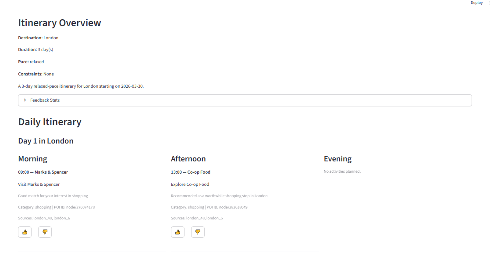
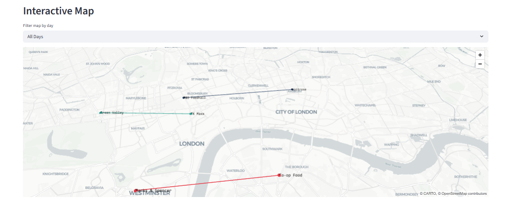
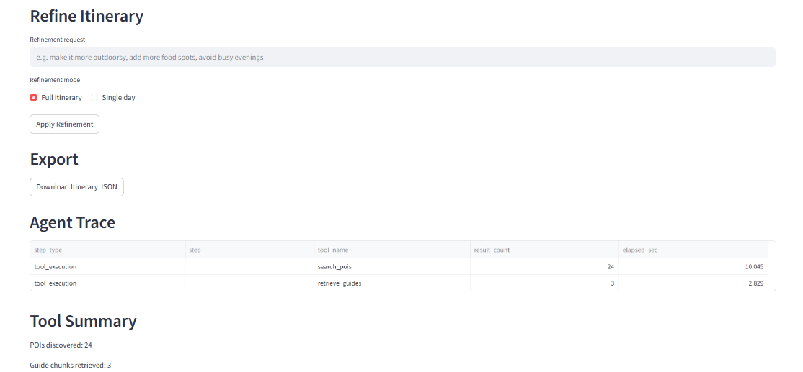

# ✈️ Trip Planner AI Agent

An intelligent, production-style AI application that generates personalized travel itineraries using real-time data, agent workflows, and user feedback loops.

---

## 📸 Demo Preview

* App Overview

* Itinerary view

* Interactive map

* Feedback system


---

## 🚀 Features

* 🤖 **AI Agent with Tool Calling (supports mock mode)**

  * Uses OpenAI Responses API
  * Multi-step reasoning with function calls

* 📍 **Live POI Search**

  * OpenStreetMap (Nominatim + Overpass)
  * Real-time places based on user interests

* 📚 **Wikivoyage RAG (Retrieval-Augmented Generation)**

  * Context-aware travel recommendations

* 🗺️ **Interactive Map (PyDeck)**

  * Visualize itinerary routes
  * Color-coded days
  * Hover tooltips

* 🔁 **Itinerary Refinement**

  * Natural language edits
  * Single-day regeneration

* 👍 **Feedback Loop System**

  * Upvote/downvote POIs
  * Improves future recommendations

* ⚡ **Fast Mode**

  * Faster results with fewer tool calls

* 💾 **Persistence**

  * Saves itinerary and state to disk

---

## 🏗️ Architecture

```
User Input (Streamlit UI)
        ↓
AI Agent (OpenAI Responses API)
        ↓
Tool Layer
 ├── search_pois (OpenStreetMap)
 ├── retrieve_guides (Wikivoyage)
        ↓
Tool State (POIs + Context)
        ↓
Itinerary Generation
        ↓
Map Visualization + Feedback Loop
```

---

## 🛠️ Tech Stack

* Python
* Streamlit
* OpenAI API
* PyDeck
* OpenStreetMap APIs
* scikit-learn (TF-IDF for RAG)

---

## ⚙️ Setup Instructions

## 🧪 Running Without OpenAI API (Mock Mode)

This project includes a fully functional **mock mode** that allows you to explore all features without an OpenAI API key or billing setup.

### What works in mock mode:

* POI search (OpenStreetMap)
* Wikivoyage travel context (RAG)
* Interactive map visualization
* Itinerary structure generation
* Refinement workflow
* Feedback system

### What is simulated:

* AI-generated itinerary reasoning
* Multi-step agent tool orchestration

Mock mode uses deterministic logic to:

* select POIs
* assign them to itinerary blocks
* generate structured outputs

This ensures the full application can be tested end-to-end without incurring API costs.

---

### To enable full AI functionality:

Provide your OpenAI API key in the sidebar after setting up billing:

1. Sign up at https://platform.openai.com
2. Add billing
3. Generate API key
4. Paste it into the app sidebar

---


### 1. Clone repo

```bash
git clone https://github.com/infoagambisa-source/trip-planner-ai-agent.git
cd trip-planner-ai-agent
```

### 2. Create virtual environment

```bash
python -m venv trip-planner-env
trip-planner-env\Scripts\activate   # Windows
```

### 3. Install dependencies

```bash
pip install -r requirements.txt
```

### 4. Run app

```bash
streamlit run app.py
```

---

## 🔑 API Requirements

| API        | Purpose        | Key Required |
| ---------- | -------------- | ------------ |
| OpenAI     | AI agent (optional - mock mode available)       | ✅ Yes        |
| Nominatim  | Geocoding      | ❌ No         |
| Overpass   | POIs           | ❌ No         |
| Wikivoyage | Travel content | ❌ No         |

💡 The app can run fully without OpenAI using mock mode.

💡 Cost estimate:

* ~$0.01–0.05 per itinerary

---

## 🧪 Example Use Cases

* Plan a **3-day food trip in Paris**
* Create a **family-friendly itinerary**
* Generate a **relaxed nature-focused trip**
* Refine itinerary: *“make it more outdoorsy”*

---

## ⚠️ Known Limitations

* Depends on external API availability
* Limited POIs in small cities
* Requires OpenAI billing for full agent mode
* Map styling not identical to Google Maps

---

## ⚠️ Note on AI Integration

Due to the absence of an active OpenAI billing setup during development, the live AI agent functionality has not been fully tested in production mode.

However:

* The agent architecture
* Function calling structure
* Tool orchestration
* Validation logic

are fully implemented and ready to work once an API key is provided.

All non-AI components have been tested end-to-end.

---

## 🔮 Future Improvements

* Multi-itinerary history
* Hotel & transport integration
* Weather-aware planning
* User accounts
* Better map UI (Mapbox/Leaflet)

---

## 🙌 Credits

* OpenAI
* OpenStreetMap
* Wikivoyage
* Streamlit

---
